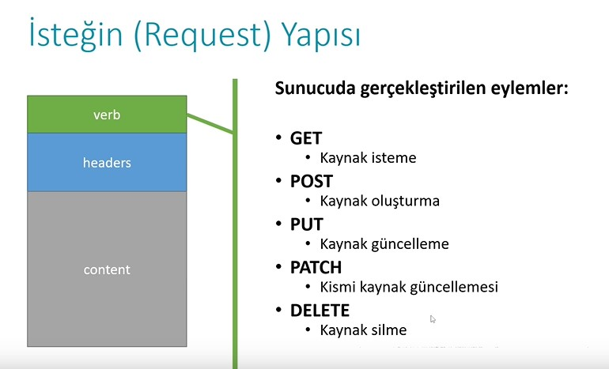
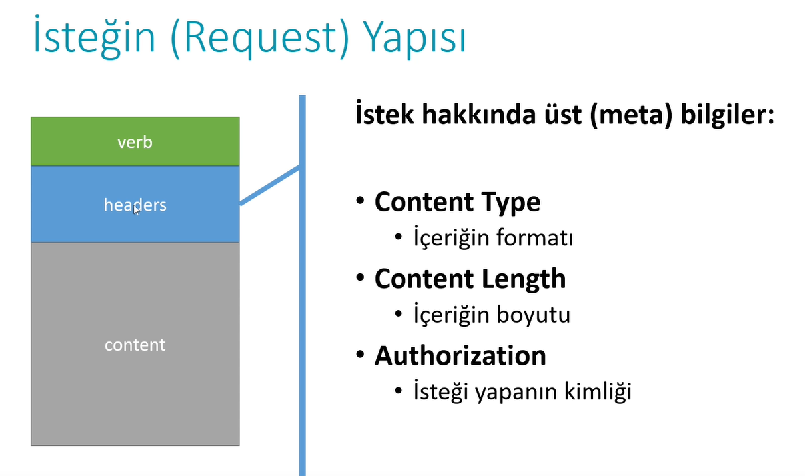
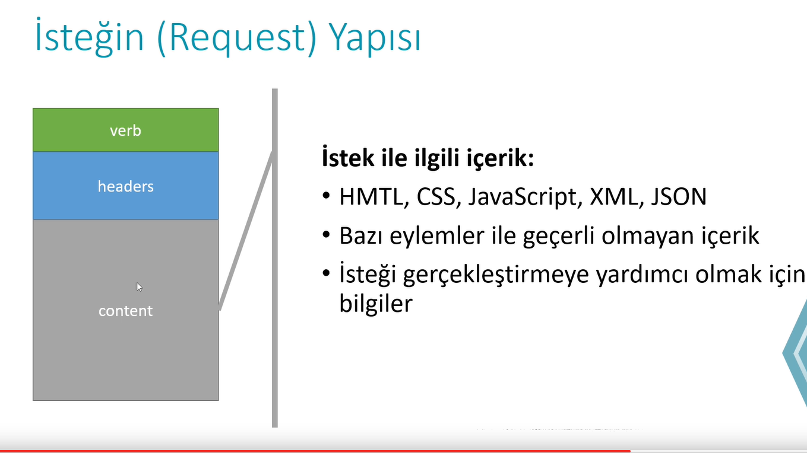
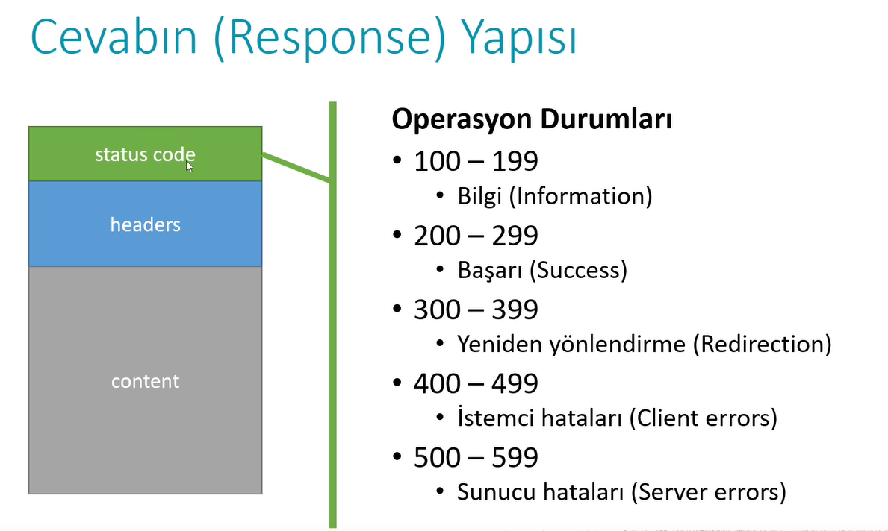
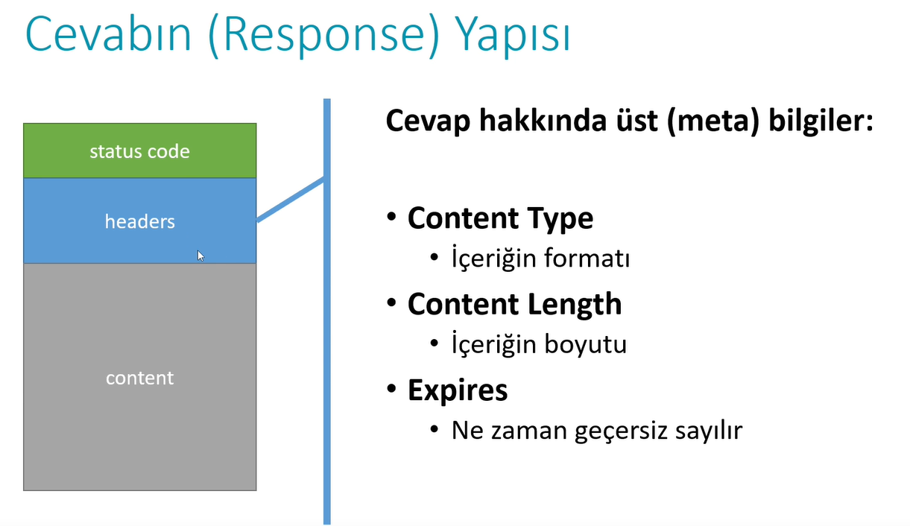
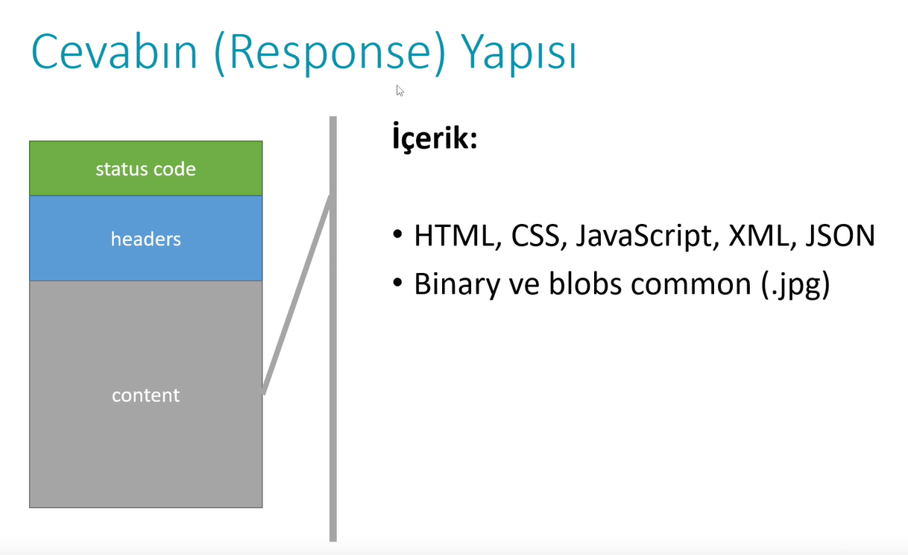

<!-- Başlık -->

  <h1 style="color:#2c3e50;">🧩 API & HTTP Temelleri</h1>

<!-- API Nedir -->
<h2>📌 API Nedir?</h2>
<blockquote>
  <strong>API (Application Programming Interface)</strong>, yazılım bileşenlerinin birbirleriyle haberleşmesini sağlayan bir arayüzdür.  
  Modern web uygulamalarının entegre çalışabilmesi için bir dizi tanım ve protokol sunar.
</blockquote>

<ul>
  <li>Teknoloji ve altyapıdan bağımsızdır.</li>
  <li>Farklı sistemlerin birbiriyle <strong>iletişim kurmasını</strong> sağlar.</li>
  <li><em>Örnek:</em> Bir hava durumu API’si, farklı uygulamalarda aynı hava bilgisini sunabilir.</li>
</ul>

   

<ul>
  <li><strong>Persistance Layer/ DataAccess Layer :</strong> Verilerin kalıcı olarak organize edilmesi, kalıcı olarak saklanması  ve bu süreç ile ilgili bütün endişelerin tek bir kanala hapsedilmesi için kullanılan katmandır.</li>
<li><strong>Services Layer :</strong> Uygulamanın ana düşüncesinin gerçekleştiği yerdir. Uygulamanın genel düşüncesi, hem fonkisiyonel hem de fonkisyonel olmayan pek çok özelliği servis katmanı üzerinden modellenir.</li>
<li><strong>Presentation Layer :</strong> Sunum katmanıdır, API'lar bu katman üzerinde konumlandırılır.  </li>
</ul>

<!-- HTTP Nedir -->
<h2>🌐 HTTP Nedir?</h2>
<blockquote>
  <strong>HTTP (Hypertext Transfer Protocol)</strong>, istemci ve sunucu arasında veri alışverişini sağlayan temel protokoldür.
</blockquote>

<h3>🛠️ HTTP'nin Temel Özellikleri</h3>
<ul>
  <li><strong>İstemci-Sunucu Modeli:</strong> Tarayıcı (istemci), veriyi sunucudan ister; sunucu yanıt döner.</li>
  <li><strong>İstek ve Yanıt:</strong> <em>Request</em> ve <em>Response</em> yapılarından oluşur.</li>
  <li><strong>Stateless:</strong> Her HTTP isteği bağımsızdır, oturum bilgisi içermez.</li>
</ul>

<!-- HTTP Methods -->
<h3>✏️ HTTP Yöntemleri</h3>
<table>
  <thead>
    <tr>
      <th>Yöntem</th>
      <th>Açıklama</th>
    </tr>
  </thead>
  <tbody>
    <tr><td><code>GET</code></td><td>Veriyi almak için kullanılır</td></tr>
    <tr><td><code>POST</code></td><td>Yeni veri göndermek için kullanılır</td></tr>
    <tr><td><code>PUT</code></td><td>Var olan veriyi güncellemek için</td></tr>
    <tr><td><code>DELETE</code></td><td>Mevcut veriyi silmek için kullanılır</td></tr>
  </tbody>
</table>

<!-- HTTP vs HTTPS -->
<h3>🔒 HTTP vs HTTPS</h3>
<ul>
  <li><strong>HTTP:</strong> Veriler şifrelenmeden iletilir.</li>
  <li><strong>HTTPS:</strong> SSL/TLS ile şifrelenmiş güvenli iletişim sağlar.</li>
</ul>

<!-- Request Yapısı -->
<h2>📨 HTTP Request Yapısı</h2>

   
   
   

<!-- Response Yapısı -->
<h2>📬 HTTP Response Yapısı</h2>

   
   
   

<!-- Footer -->

  <em>Hazırlayan: <strong>Senin Adın</strong> • GitHub Notları • 2025</em>

