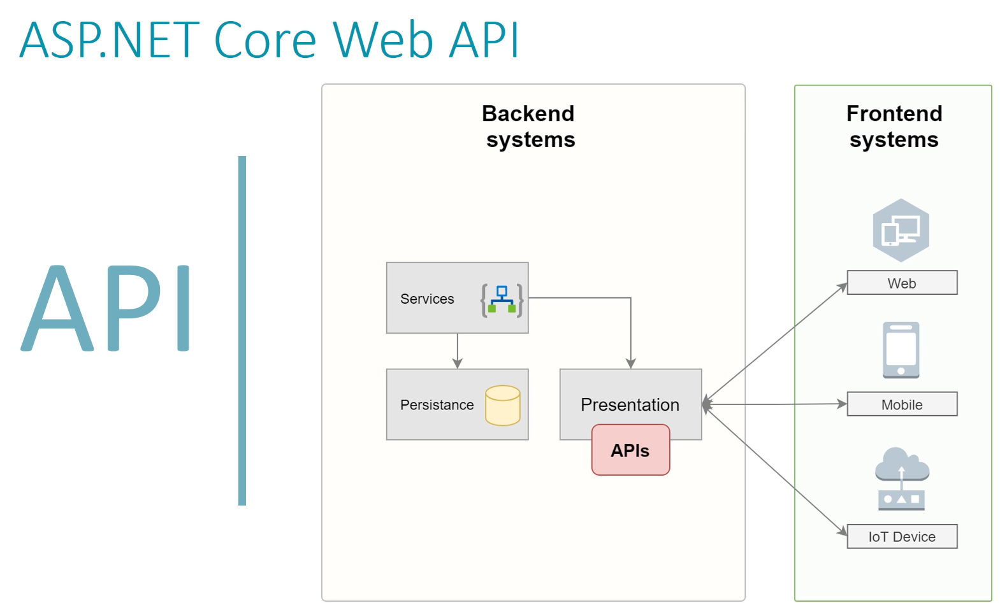

<!-- Başlık -->

  <h1 style="color:#2c3e50;">🧩 API Temelleri</h1>

<!-- API Nedir -->
<h2>📌 API Nedir?</h2>
<blockquote>
  <strong>API (Application Programming Interface)</strong>, Yazılım bileşenlerinin birbirleriyle haberleşmesini sağlayan bir  <strong>arayüzdür. </strong>  
  Modern web uygulamalarının entegre çalışabilmesi için bir dizi tanım ve protokol sunar.
</blockquote>

<ul>
  <li>Teknoloji ve altyapıdan bağımsızdır.</li>
  <li>Farklı sistemlerin birbiriyle <strong>iletişim kurmasını</strong> sağlar.</li>
  <li><em>Örnek:</em> Bir hava durumu API’si, farklı uygulamalarda aynı hava bilgisini sunabilir.</li>
</ul>

   

<ul>
  <li><strong>Persistance Layer/ DataAccess Layer :</strong> Verilerin kalıcı olarak organize edilmesi, kalıcı olarak saklanması  ve bu süreç ile ilgili bütün endişelerin tek bir kanala hapsedilmesi için kullanılan katmandır.</li>
<li><strong>Services Layer :</strong> Uygulamanın ana düşüncesinin gerçekleştiği yerdir. Uygulamanın genel düşüncesi, hem fonkisiyonel hem de fonkisyonel olmayan pek çok özelliği servis katmanı üzerinden modellenir.</li>
<li><strong>Presentation Layer :</strong> Sunum katmanıdır, API'lar bu katman üzerinde konumlandırılır.  </li>
</ul>

<!-- Footer -->

  <em>Hazırlayan: <strong>Büşra Güneş</strong> • Asp.Net Core Web API Notları • 2025</em>

