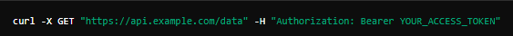

  <h1 style="color:#2c3e50;">🧩 CURL (Client URL)</h1>
<blockquote>
curl, komut satırında çalışan ve veri iletimi yapmak için kullanılan bir araçtır. curl, genellikle HTTP, HTTPS, FTP gibi çeşitli protokoller aracılığıyla veri gönderip almak için kullanılır. 
API'ler ile etkileşime geçmek için de sıklıkla curl kullanılır.
</blockquote>

<blockquote>
Kısacası, curl bir araçtır ve API'ler ile etkileşimde bulunmak için kullanılabilir. Örneğin, bir web API'sine GET isteği göndermek için curl kullanabilirsiniz. Örnek bir curl komutu şu şekilde olabilir:
</blockquote>

 

<blockquote>

bu komut, <i>  https://api.example.com/data  </i> adresine bir GET isteği gönderir ve Authorization başlığı ile kimlik doğrulaması yapar.

</blockquote>