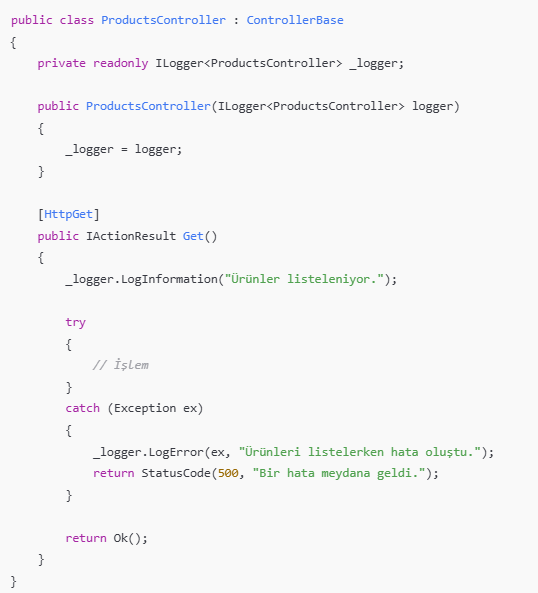
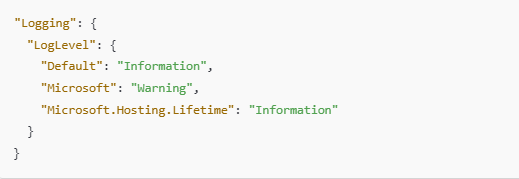

 <h1 style="color:#2c3e50;">📝 ILogger Kullanımı</h1> 
 <h2>📌 ILogger Nedir?</h2>
 <blockquote> <strong>ILogger&lt;T&gt;</strong>, .NET uygulamalarında kullanılan yerleşik bir loglama sistemidir. Uygulama içindeki olayları, hataları, uyarıları ve bilgileri sistematik şekilde kaydederek izlenebilirliği artırır. 
 </blockquote> 
 <h3>📋 ILogger Kullanım Amaçları</h3> <ul> <li><strong>Hataları İzleme:</strong> Uygulama hatalarını sistemli biçimde kaydederek analiz imkânı sunar.</li> <li><strong>Uygulama Akışını Görme:</strong> Bilgilendirici loglarla uygulama davranışı izlenebilir.</li> <li><strong>Performans Takibi:</strong> Gecikme, yoğunluk gibi durumlar loglar üzerinden takip edilebilir.</li> <li><strong>Üretim Ortamında İzleme:</strong> Canlı sistemlerde yaşanan problemleri anlamak için gereklidir.</li> </ul> <!-- ILogger Log Seviyeleri --> <h3>📊 Log Seviyeleri</h3> <table> <thead> <tr> <th>Seviye</th> <th>Açıklama</th> </tr> </thead> <tbody> <tr><td><code>Trace</code></td><td>Detaylı teknik loglar. Hata ayıklama için en ayrıntılı seviye.</td></tr> <tr><td><code>Debug</code></td><td>Geliştirme sürecinde kullanılan hata ayıklama logları.</td></tr> <tr><td><code>Information</code></td><td>Genel bilgi mesajları. Uygulama akışının izlendiği seviye.</td></tr> <tr><td><code>Warning</code></td><td>Beklenmeyen ancak kritik olmayan durumlar.</td></tr> <tr><td><code>Error</code></td><td>Uygulamanın işleyişini etkileyen hatalar.</td></tr> <tr><td><code>Critical</code></td><td>Uygulamanın çökmesine neden olabilecek ciddi hatalar.</td></tr> </tbody> </table> 
 <!-- ILogger Kullanımı --> <h2>🛠️ ILogger Nasıl Kullanılır?</h2> 
<strong>ILogger</strong> kullanmak için sınıfın constructor'ına enjekte edilir. Böylece sınıf özelinde loglama yapılabilir.

   
  

 <!-- Log Ayarları --> <h2>⚙️ Log Ayarları (appsettings.json)</h2> 
Log seviyeleri <code>appsettings.json</code> üzerinden ayarlanabilir.

   
  

  <ul> <li><strong>Default:</strong> Uygulama genelinde geçerli seviye.</li> <li><strong>Microsoft:</strong> .NET sistem logları için geçerli seviye.</li> </ul> 
 <!-- Log Sağlayıcılar --> <h2>📤 Log Sağlayıcıları</h2> 
<strong>ILogger</strong> arayüzü soyuttur. Loglamayı gerçekleştiren sağlayıcılar şunlardır:
 <ul> <li>🖥️ Console Logger (varsayılan)</li> <li>📁 File Logger (örn. Serilog ile dosyaya log yazma)</li> <li>☁️ Azure Application Insights</li> <li>📊 Seq, Kibana + Elasticsearch</li> </ul> 
 <!-- Footer --> 
 <em>Hazırlayan: <strong>Büşra Güneş</strong> • Asp.Net Core Web API Notları • 2025</em> 
