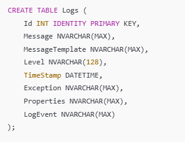
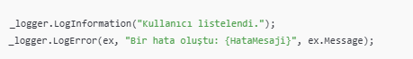

 <h1 style="color:#2c3e50;">🧩 Serilog ile Veritabanına Loglama</h1> 
 <h2>🔧 Neden Serilog?</h2> <blockquote> Serilog, .NET uygulamaları için yapılandırması kolay, esnek ve güçlü bir loglama kütüphanesidir. <strong>ILogger</strong> arayüzü ile uyumludur ve <strong>SQL Server</strong> dahil birçok hedefe log yazabilir. </blockquote>
<h3>📦 Gerekli NuGet Paketleri</h3>

   
  

  <h3>🛠️ SQL Server'da Log Tablosu Oluştur</h3>
  

   
  

  <h3>⚙️ Program.cs veya appsettings.json Konfigürasyonu</h3>
    <h4>Program.cs (Minimal API için örnek)::</h4>
    <blockquote>
    
using Serilog;

using Serilog.Sinks.MSSqlServer;

using System.Collections.ObjectModel;

var columnOptions = new ColumnOptions

{

&nbsp;&nbsp;&nbsp;&nbsp;AdditionalColumns = new Collection&lt;SqlColumn&gt;

&nbsp;&nbsp;&nbsp;&nbsp;{

&nbsp;&nbsp;&nbsp;&nbsp;&nbsp;&nbsp;&nbsp;&nbsp;new SqlColumn

&nbsp;&nbsp;&nbsp;&nbsp;&nbsp;&nbsp;&nbsp;&nbsp;{

&nbsp;&nbsp;&nbsp;&nbsp;&nbsp;&nbsp;&nbsp;&nbsp;&nbsp;&nbsp;&nbsp;&nbsp;ColumnName = "Username",

&nbsp;&nbsp;&nbsp;&nbsp;&nbsp;&nbsp;&nbsp;&nbsp;&nbsp;&nbsp;&nbsp;&nbsp;DataType = System.Data.SqlDbType.NVarChar,

&nbsp;&nbsp;&nbsp;&nbsp;&nbsp;&nbsp;&nbsp;&nbsp;&nbsp;&nbsp;&nbsp;&nbsp;DataLength = 100

&nbsp;&nbsp;&nbsp;&nbsp;&nbsp;&nbsp;&nbsp;&nbsp;}

&nbsp;&nbsp;&nbsp;&nbsp;}

};

Log.Logger = new LoggerConfiguration()

&nbsp;&nbsp;&nbsp;&nbsp;.WriteTo.Console() // Konsola loglama

&nbsp;&nbsp;&nbsp;&nbsp;.WriteTo.MSSqlServer( // Veritabanına loglama

&nbsp;&nbsp;&nbsp;&nbsp;&nbsp;&nbsp;&nbsp;&nbsp;connectionString: "Server=.;Database=MyLogsDb;Trusted_Connection=True;",

&nbsp;&nbsp;&nbsp;&nbsp;&nbsp;&nbsp;&nbsp;&nbsp;sinkOptions: new MSSqlServerSinkOptions

&nbsp;&nbsp;&nbsp;&nbsp;&nbsp;&nbsp;&nbsp;&nbsp;{

&nbsp;&nbsp;&nbsp;&nbsp;&nbsp;&nbsp;&nbsp;&nbsp;&nbsp;&nbsp;&nbsp;&nbsp;TableName = "Logs",

&nbsp;&nbsp;&nbsp;&nbsp;&nbsp;&nbsp;&nbsp;&nbsp;&nbsp;&nbsp;&nbsp;&nbsp;AutoCreateSqlTable = false

&nbsp;&nbsp;&nbsp;&nbsp;&nbsp;&nbsp;&nbsp;&nbsp;},

&nbsp;&nbsp;&nbsp;&nbsp;&nbsp;&nbsp;&nbsp;&nbsp;columnOptions: columnOptions

&nbsp;&nbsp;&nbsp;&nbsp;)

&nbsp;&nbsp;&nbsp;&nbsp;.CreateLogger();

</blockquote>
    

<h3>🧪 Örnek Kullanım</h3>

   
  

  <h2>📌 Ek Bilgiler</h2>
     <blockquote> 
<li>AutoCreateSqlTable = true kullanarak tabloyu otomatik oluşturabilirsin (geliştirme için uygundur).</li>
<li>Properties kolonu sayesinde loglara ekstra bilgiler (UserId, IP, vb.) ekleyebilirsin.</li>
<li>Performans için async logging ve batch ayarları da yapılabilir.</li>
   </blockquote>
   

 <em>Hazırlayan: <strong>Büşra Güneş</strong> • Asp.Net Core Loglama Notları • 2025</em> 
